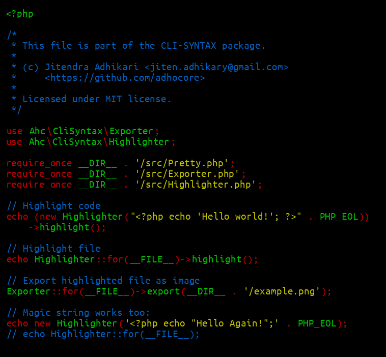

## adhocore/cli-syntax

[](https://github.com/adhocore/php-cli-syntax/releases)
[](https://travis-ci.com/adhocore/php-cli-syntax?branch=master)
[](https://scrutinizer-ci.com/g/adhocore/php-cli-syntax/?branch=master)
[](https://codecov.io/gh/adhocore/php-cli-syntax)
[](https://styleci.io/repos/229348504)
[](./LICENSE)


## Installation

### As standalone binary

```sh
composer global require adhocore/cli-syntax

# then you will be able to run it as
clish -h
clish -f file.php
echo '<?php date("Ymd");' | clish
cat file.php | clish

# export png
clish -f file.php -o file.png
```

### As project dependency
```bash
composer require adhocore/cli-syntax
```

## Usage

You can either highlight PHP code in terminal output or export to png image.

### Highlight

```php
use Ahc\CliSyntax\Highlighter;

// PHP code
echo new Highlighter('<?php echo "Hello world!";');
// OR
echo (new Highlighter)->highlight('<?php echo "Hello world!";');

// PHP file
echo Highlighter::for('/path/to/file.php');
```

### Export

```php
use Ahc\CliSyntax\Exporter;

// PHP file
Exporter::for('/path/to/file.php')->export('file.png');
```

See [example usage](./example.php). Here's how the export looks like:




### Customisation

If you would like to change color etc, extend the classes
[`Highlighter`](./src/Highlighter.php) and [`Exporter`](./src/Exporter.php),
then override `visit()` method which recieves [`DOMNode`](https://php.net/DOMNode).

## Contributing

Please check [the guide](./CONTRIBUTING.md).

## LICENSE

> &copy; [MIT](./LICENSE) | 2019, Jitendra Adhikari

### Credits

This project is bootstrapped by [phint](https://github.com/adhocore/phint)
and releases managed by [please](https://github.com/adhocore/please).
